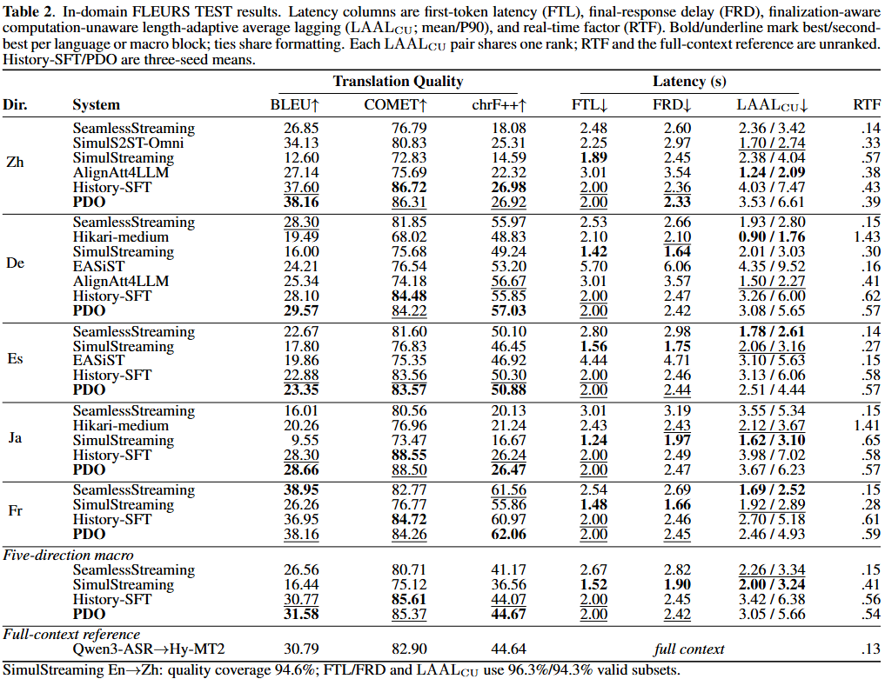

# Persistent Delivery Optimization for Streaming Speech-to-Text Translation with Revisions

Official code and checkpoints for
[*Persistent Delivery Optimization for Streaming Speech-to-Text Translation with Revisions*](https://arxiv.org/abs/2609.26427),
submitted to **ICASSP 2027**.

[](https://arxiv.org/abs/2609.26427)
[](https://huggingface.co/hf-wzx1205/PDO_S2TT)
[](https://modelscope.cn/models/wanzixiang/PDO_S2TT)
[](https://github.com/ggiggit/PDO_S2TT/actions/workflows/tests.yml)
[](LICENSE)

**Direct streaming S2TT · Revision-aware training · Five target languages**

PDO trains a streaming speech-to-text translation model to emit content that
appears early **and remains unchanged**. The model translates growing English
speech directly into revisable Chinese, German, Spanish, Japanese, or French,
without exposing an intermediate transcript.

## Choose your path

| I want to… | Start here | What it contains |
|:--|:--|:--|
| **Run the model** | [Inference & evaluation](docs/inference.md) | Install, checkpoint download, one WAV, FLEURS TEST, all metrics |
| **Train PDO** | [Training reproduction](docs/training.md) | SFT initialization, four-GPU command, resume, exact recipe, DEV selection |
| **Match paper formulas to code** | [Paper ↔ code](docs/paper-to-code.md) | Eq. (1)–(4), reward units, baseline, sampling, loss, LAAL-CU |

## Model weights

The released weights are mirrored on
[Hugging Face](https://huggingface.co/hf-wzx1205/PDO_S2TT) and
[ModelScope](https://modelscope.cn/models/wanzixiang/PDO_S2TT).

| File | Use | Download |
|:--|:--|:--|
| `pdo_s2tt.pt` | Main inference checkpoint | [Download](https://huggingface.co/hf-wzx1205/PDO_S2TT/blob/62c27b03aa1d7da1b739e43e815796029ee243f5/pdo_s2tt.pt) |
| `pdo_s2tt_sft.pt` | SFT initialization for PDO training | [Download](https://huggingface.co/hf-wzx1205/PDO_S2TT/blob/62c27b03aa1d7da1b739e43e815796029ee243f5/pdo_s2tt_sft.pt) |

## Quick inference

Linux, Python 3.12, CUDA, and a GPU with at least 16 GB memory are recommended.

```bash
git clone https://github.com/ggiggit/PDO_S2TT.git
cd PDO_S2TT

python3.12 -m venv .venv
source .venv/bin/activate
python -m pip install -e .

mkdir -p checkpoints
hf download hf-wzx1205/PDO_S2TT pdo_s2tt.pt \
  --revision 62c27b03aa1d7da1b739e43e815796029ee243f5 \
  --local-dir checkpoints

bash scripts/run_fleurs.sh
```

The default command downloads official FLEURS TEST and reproduces all 647 En→Zh
examples. The other four directions and macro command are already included and
commented in [`scripts/run_fleurs.sh`](scripts/run_fleurs.sh).

## Quick training

```bash
python scripts/prepare_fleurs_train.py

hf download hf-wzx1205/PDO_S2TT pdo_s2tt_sft.pt \
  --revision 62c27b03aa1d7da1b739e43e815796029ee243f5 \
  --local-dir checkpoints

bash scripts/train_pdo.sh
```

The frozen recipe uses four 24 GB GPUs, 407 rollout rounds, and 1,625 AdamW
updates. It saves an inference checkpoint and resumable optimizer state every
round. See the [training guide](docs/training.md) before starting a full run.

<details>
<summary><strong>Independent public-code verification</strong></summary>

The released training path was independently run from the SFT initialization
through all 407 rounds and five-direction TEST evaluation. Detailed logs,
optimizer state, predictions, and metrics are kept in the
[reproduction record](docs/reproduction.md), with large artifacts hosted in a
[separate archive](https://huggingface.co/hf-wzx1205/PDO_S2TT-reproduction).

</details>

## Results

FLEURS TEST results reported in Table 2 of the paper (647 examples per
direction):



## Repository layout

```text
src/                       model, streaming runtime, PDO, metrics
scripts/                   inference, evaluation, and training entry points
docs/                      the three focused guides above
artifacts/reproduction/    lightweight training/test receipts
references/                frozen FLEURS identities and TRAIN targets
tests/                     reward, policy, evaluator, inventory tests
```

## License

Code and PDO checkpoints are released under [Apache-2.0](LICENSE). Upstream models
and datasets retain their own licenses.
